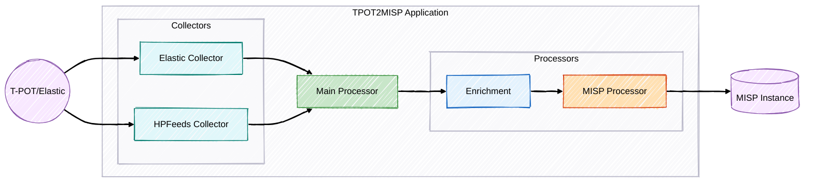

# T-Pot to MISP Integration

  
  
  

Scalable integration between the T-Pot honeypot platform and the Malware Information Sharing Platform (MISP), designed to support organizations at varying levels of threat‑intelligence maturity. 

## 📋 Index

- [Overview](#-overview)
- [Key Features](#-key-features)
- [Simplified Architecture](#️-simplified-architecture)
- [Requirements](#-requirements)
- [Installation](#-installation)
  - [Docker Method (Recommended)](#docker-method-recommended)
  - [Traditional Method](#traditional-method)
- [Configuration](#️-configuration)
- [How to Use](#-how-to-use)
- [Monitoring and Validation](#-monitoring-and-validation)
- [Troubleshooting](#-troubleshooting)
- [Technical Documentation](#-technical-documentation)
- [License](#-license)

## 🔍 Overview

This application automates the collection of attack data from T-Pot honeypots, enriches it (optionally), and sends it to a MISP instance, creating structured events for threat intelligence analysis and sharing.

**Operation Modes:**
- **Batch:** Collects data periodically from T-Pot's Elasticsearch.
- **Real-time:** Collects data in real-time via HPFEEDS.

## ✨ Key Features

- **Flexible Collection:** Support for Batch (Elasticsearch) and Real-time (HPFEEDS) modes.
- **Intelligent Grouping:** Creates a daily MISP event per honeypot type, avoiding duplicates.
- **Optional Enrichment:** Integration with VirusTotal, AbuseIPDB, and GreyNoise (with caching).
- **Easy Review:** Events created as unpublished by default (automatic publication configurable).
- **Monitoring:** Optional Prometheus metrics and structured logs.
- **Validation Reports:** Automatic generation of reports (TXT/JSON) to facilitate validation of data sent to MISP.
- **Resilience:** Robust error handling.

## 🏗️ Simplified Architecture

The system has collectors (Elasticsearch, HPFEEDS), processors (Enrichment, MISP), and utilities (Logging, Metrics, Validation, etc.), orchestrated by `main.py`.

*For a detailed view of the architecture and file structure, see the [Technical Documentation](docs/project.md#architecture).*

## 📋 Requirements

- Python 3.8+
- T-Pot installed and configured (with Elasticsearch or HPFEEDS enabled)
- Accessible MISP instance with API key
- (Optional) API keys for enrichment services
- (Optional) Docker and Docker Compose

## 🚀 Installation

### Docker Method (Recommended)

1.  Clone the repository: `git clone https://github.com/andradelucascq/tpot2misp.git && cd tpot2misp`
2.  Copy and edit the `.env` file: `cp .env.example .env && nano .env`
3.  Run: `chmod +x scripts/start-tpot2misp.sh && ./scripts/start-tpot2misp.sh`

**Useful commands:**
- Logs: `docker-compose logs -f`
- Stop: `docker-compose down`
- Restart: `docker-compose restart`
- Rebuild: `docker-compose build && docker-compose up -d`

### Traditional Method

1.  Clone the repository and enter the directory.
2.  Create a virtual environment: `python -m venv venv && source venv/bin/activate` (or `venv\Scripts\activate` on Windows)
3.  Install dependencies: `pip install -r requirements.txt`
4.  Configure `.env`: `cp .env.example .env && nano .env`

## ⚙️ Configuration

The main configuration is done via the `.env` file. Copy `.env.example` to `.env` and adjust the variables:

- **`COLLECTION_MODE`**: `batch` or `realtime`.
- **MISP Settings**: `MISP_URL`, `MISP_KEY`, `MISP_VERIFY_SSL`, `AUTO_PUBLISH`, `PUBLISH_DELAY`.
- **Batch Settings (Elasticsearch)**: `ELASTICSEARCH_URL`, `ELASTICSEARCH_USER`, `ELASTICSEARCH_PASSWORD`, `TPOT_HONEYPOTS`, `LOOKBACK_DAYS`.
- **Realtime Settings (HPFEEDS)**: `HPFEEDS_HOST`, `HPFEEDS_PORT`, `HPFEEDS_IDENT`, `HPFEEDS_SECRET`, `HPFEEDS_CHANNELS`.
- **Enrichment Settings**: `ENRICHMENT_ENABLED`, `CACHE_DURATION`, API keys (`VIRUSTOTAL_API_KEY`, etc.).
- **Log Settings**: `LOG_LEVEL`, `LOG_FILE_ENABLED`, `LOG_FILE_PATH`, `LOG_FORMAT`.
- **Validation Report**: `VALIDATION_REPORT_ENABLED`, `VALIDATION_REPORT_DIR`, `VALIDATION_REPORT_FORMAT`.
- **Prometheus Metrics**: `PROMETHEUS_ENABLED`, `PROMETHEUS_PORT`.

*For details on each configuration variable, see the [Technical Documentation](docs/project.md#configuration).*

## 📝 How to Use

After installation and configuration:

- **Batch Mode (Single or Periodic Execution):**
  - If `BATCH_INTERVAL_HOURS` > 0 in `.env`, it will run periodically.
  - If `BATCH_INTERVAL_HOURS` = 0 or not defined, it will run once and exit.
  - Run: `python main.py` (or via Docker).
  - For scheduling (if not using `BATCH_INTERVAL_HOURS`), use `cron` or Windows Task Scheduler. Cron example: `0 * * * * cd /path/to/tpot2misp && ./venv/bin/python main.py`

- **Real-time Mode:**
  - Run: `python main.py` (or via Docker).
  - Use a process manager (systemd, supervisor) for continuous execution in production.

## 📊 Monitoring and Validation

- **Logs:** Check the console or the file configured in `LOG_FILE_PATH`.
- **Validation Reports:** TXT/JSON files generated in the `VALIDATION_REPORT_DIR` directory after batch mode executions. Useful for analysts to verify the data sent.
- **Prometheus Metrics:** Access `http://<host>:<PROMETHEUS_PORT>/metrics` if enabled.

*For details about metrics and log/report formats, see the [Technical Documentation](docs/project.md#monitoring-and-diagnostics).*

## 🚑 Troubleshooting

- **`media_type_header_exception` Error (Elasticsearch):** Usually caused by T-Pot's Nginx proxy. The custom client in this project (`utils/elasticsearch_client.py`) already handles this. Verify your credentials and URL (`https://<tpot-ip>:64297/es/` - the trailing slash is important).
- **401 Error (Elasticsearch/MISP):** Check the credentials (`ELASTICSEARCH_USER`/`PASSWORD` or `MISP_KEY`) in the `.env` file.
- **No events collected:** Check the `TPOT_HONEYPOTS`, `LOOKBACK_DAYS` (batch) or `HPFEEDS_CHANNELS` (realtime) configuration. Make sure T-Pot is generating events.
- **Use the test scripts:**
  - `python scripts/test_elasticsearch_connection.py`
  - `python scripts/test_misp_connection.py`

## 📚 Technical Documentation

For in-depth information about the architecture, processing flow, component details, extension guides, and more, see the document:

➡️ **[`docs/project.md`](docs/project.md)**

## 📜 License

This project is licensed under the MIT License. See the `LICENSE` file for more details.

