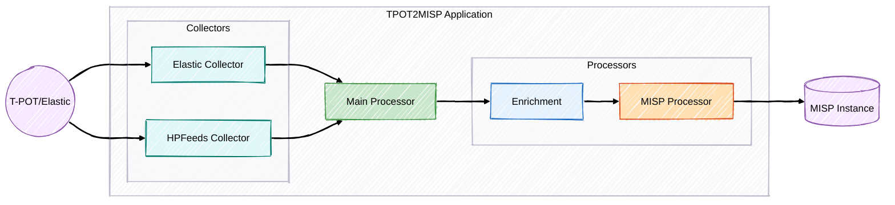

# T-Pot to MISP Integration

[](project.md)

<p align="center">
  
  
</p>

Uma solução robusta e escalável para integração entre a plataforma de honeypots T‑Pot e o Malware Information Sharing Platform (MISP), projetada para suportar organizações em diferentes níveis de maturidade em inteligência de ameaças.

> **Nota:** Este projeto foi desenvolvido para atender a uma necessidade real de integração.

## 📋 Índice
1. [Visão Geral](#visão-geral)
2. [Arquitetura](#arquitetura)
3. [Modos de Operação](#modos-de-operação)
4. [Componentes Principais](#componentes-principais)
5. [Fluxo de Processamento](#fluxo-de-processamento)
6. [Enriquecimento de Indicadores](#enriquecimento-de-indicadores)
7. [Correlação e Criação de Eventos](#correlação-e-criação-de-eventos)
8. [Configuração](#configuração)
9. [Casos de Uso](#casos-de-uso)
10. [Monitoramento e Diagnóstico](#monitoramento-e-diagnóstico)
11. [Desenvolvimento e Extensão](#desenvolvimento-e-extensão)
12. [Perguntas Frequentes](#perguntas-frequentes)

---

## 🔍 Visão Geral

### Motivação

Honeypots capturam tentativas de comprometimento e geram grandes volumes de dados sobre potenciais ameaças. O processo tradicional de análise destes dados é manual:

1. Extrair logs dos honeypots
2. Analisar indicadores suspeitos (IPs, URLs, etc.)
3. Enriquecer manualmente com informações de fontes externas
4. Criar eventos no MISP
5. Publicar para compartilhamento com a comunidade

Nosso projeto automatiza esta cadeia, permitindo que analistas foquem na validação e análise de ameaças mais complexas e também possibilita a implementação de inteligencia cibernética para diferentes tipos de maturidade.

### Benefícios

- **Economia de tempo**: Automatiza tarefas repetitivas de enriquecimento e criação de eventos
- **Consistência**: Garante que todos os eventos seguem o mesmo padrão de formatação
- **Velocidade**: Reduz o tempo entre detecção e compartilhamento
- **Flexibilidade**: Adapta-se a diferentes configurações e fluxos de trabalho
- **Qualidade**: Enriquece automaticamente indicadores com múltiplas fontes de inteligência

### Propósito Educacional

Este projeto foi desenvolvido não apenas como uma solução prática para integração T-Pot/MISP, mas também como um estudo aprofundado de:

- **Comunicação com API do MISP**: Explorando as possibilidades e limitações da API de inteligência de ameaças
- **Parsing e consultas via Elasticsearch**: Aprendendo técnicas eficientes para extrair dados relevantes
- **Implementação da biblioteca PyMISP**: Compreendendo o uso prático da biblioteca oficial para automação de tarefas no MISP
- **Arquitetura modular Python**: Aplicando princípios de design de software para criar código manutenível e extensível

---

## 🏗️ Arquitetura



### Estrutura do Projeto

```
tpot2misp/
├── collectors/               # Módulos de coleta de dados
│   ├── elastic_collector.py  # Coleta em modo batch via Elasticsearch
│   └── hpfeeds_collector.py  # Coleta em tempo real via HPFEEDS
├── processors/               # Módulos de processamento de dados
│   ├── misp_processor.py     # Lógica de integração com MISP
│   └── enrichment_processor.py # Funcionalidade de enriquecimento de IoC
├── utils/                    # Módulos utilitários
│   ├── elasticsearch_client.py # Cliente customizado para Elasticsearch do T-Pot
│   ├── error_handling.py     # Tratamento de erros centralizado
│   ├── logging.py            # Logging estruturado
│   ├── metrics.py            # Métricas do Prometheus
│   └── validators.py         # Utilitários de validação de IP
├── config/                   # Arquivos de configuração
│   ├── __init__.py
│   └── settings.py           # Configurações carregadas do ambiente
├── docker/                   # Arquivos relacionados ao Docker
│   └── Dockerfile            # Instruções para criar a imagem Docker
├── docs/                     # Documentação
│   └── project.md            # Documentação detalhada do projeto
├── scripts/                  # Scripts utilitários
│   ├── attack_simulator_scapy.py       # Simulador de ataques para testes
│   ├── start-tpot2misp.sh              # Script para iniciar o container Docker
│   ├── test_elasticsearch_connection.py # Teste de conexão com Elasticsearch
│   └── test_misp_connection.py         # Teste de conexão com MISP
├── docker-compose.yml        # Configuração do Docker Compose
├── .env                      # Configuração de variáveis de ambiente
└── main.py                   # Ponto de entrada da aplicação
└── readme.md                   # Readme
```

### Princípios de Design

1. **Separação de Responsabilidades**: Cada componente tem uma função específica
2. **Interfaces Claras**: Componentes se comunicam por interfaces padronizadas
3. **Configurabilidade**: Comportamento modificável via configuração
4. **Observabilidade**: Logs estruturados e métricas
5. **Resiliência**: Tratamento de erros e recuperação de falhas

---

## 🔄 Modos de Operação

### Modo Batch

- Processa eventos do T-Pot via Elasticsearch (`collectors/elastic_collector.py`)
- Ideal para execução agendada (cron)
- Baixo consumo de recursos

**Configuração típica:**
```env
COLLECTION_MODE=batch
ELASTICSEARCH_URL=http://localhost:9200
ELASTICSEARCH_USER=elastic
ELASTICSEARCH_PWD=changeme
TPOT_HONEYPOTS=cowrie,dionaea
LOOKBACK_DAYS=1
```

### Modo Realtime

- Conecta-se ao broker HPFEEDS do T-Pot (`collectors/hpfeeds_collector.py`)
- Processa eventos em tempo real
- Resposta quase instantânea a novos ataques

**Configuração típica:**
```env
COLLECTION_MODE=realtime
HPFEEDS_HOST=localhost
HPFEEDS_PORT=10000
HPFEEDS_IDENT=tpot
HPFEEDS_SECRET=your-secret-key
HPFEEDS_CHANNELS=tpot.events
```

---

## 🧩 Componentes Principais

### Coletores de Eventos (`collectors/`)

#### ElasticCollector (`elastic_collector.py`)
- Lê e analisa eventos do T-Pot via Elasticsearch
- Suporta múltiplos tipos de honeypot
- Usa o padrão Strategy para diferentes tipos de honeypot
- Queries otimizadas para melhor performance

#### HPFeedsCollector (`hpfeeds_collector.py`)
- Coleta em tempo real via HPFEEDS
- Conexão persistente e reconexão automática
- Processamento assíncrono de mensagens

### Processadores (`processors/`)

#### EnrichmentProcessor (`enrichment_processor.py`)
- Gerencia múltiplos provedores de enriquecimento
- Processamento paralelo e cache
- Avaliação de reputação e validade

#### Provedores (dentro de `EnrichmentProcessor`)
- **VirusTotalEnricher**: reputação global, estatísticas
- **AbuseIPDBEnricher**: pontuação de abuso, histórico
- **GreyNoiseEnricher**: scanners conhecidos, classificação

#### MISPProcessor (`misp_processor.py`)
- Criação estruturada de eventos no MISP
- Correlação com eventos existentes
- Adição de objetos e atributos padronizados
- Suporte a taxonomias e tags

### Utilidades (`utils/`)

#### Logging (`logging.py`)
- Logs estruturados em JSON ou texto
- Níveis configuráveis e rotação automática de arquivos

#### Metrics (`metrics.py`)
- Métricas Prometheus: eventos, erros, duração, etc.
- Exposição via endpoint HTTP

#### Error Handling (`error_handling.py`)
- Classes e funções para tratamento centralizado de erros
- Garante resiliência e log detalhado de falhas

#### Validators (`validators.py`)
- Funções para validar dados de entrada (ex: IPs)

#### Validation Report (`validation_report.py`)
- Geração de relatórios detalhados para validação por analistas
- Suporte a formatos TXT e JSON
- Rastreamento de atributos por tipo de honeypot
- Contabilização de eventos MISP criados e atualizados
- Estatísticas totais para facilitar a validação

### Scripts Utilitários (`scripts/`)

Os scripts utilitários fornecem ferramentas de diagnóstico, teste e inicialização do sistema:

#### `test_elasticsearch_connection.py`
Script de diagnóstico que testa a conexão com o Elasticsearch do T-Pot:
- Utiliza o cliente customizado (`elasticsearch_client.py`) 
- Verifica autenticação, conexão e disponibilidade dos índices
- Fornece mensagens detalhadas de erro para facilitar o troubleshooting
- Implementado com tratamento específico para problemas comuns (cabeçalhos HTTP, SSL)

#### `test_misp_connection.py`
Script de diagnóstico que testa a comunicação com a instância MISP:
- Verifica a configuração e autenticação com a API MISP
- Testa operações básicas (obter versão, buscar eventos, atributos e taxonomias)
- Compatível com diferentes versões da API PyMISP
- Fornece orientações detalhadas para resolução de problemas

#### `attack_simulator_scapy.py`
Simulador de ataques para testar o pipeline de detecção:
- Utiliza a biblioteca Scapy para gerar tráfego simulado
- Permite testes controlados sem exposição a ameaças reais
- Útil para validar a configuração do T-Pot e a integração com MISP
- Ferramenta para testes de integração e validação do pipeline completo

#### `start-tpot2misp.sh`
Script de inicialização para o ambiente Docker:
- Cria diretórios necessários para persistência de dados
- Inicia os contêineres via docker-compose
- Fornece instruções para monitoramento e gerenciamento do serviço
- Simplifica o processo de implantação e manutenção

Estes scripts são componentes essenciais para diagnóstico, testes e operações do sistema, fornecendo ferramentas práticas para garantir o funcionamento adequado da integração T-Pot/MISP.

### Ponto de Entrada (`main.py`)
- Orquestra o fluxo da aplicação baseado no modo de operação
- Inicializa os componentes necessários

---

## ⚙️ Fluxo de Processamento

1. **Inicialização** (`main.py`): 
   - Carrega configurações (`settings.py`)
   - Inicializa logger (`logging.py`), métricas (`metrics.py`)
   - Inicializa processadores (`MISPProcessor`, `EnrichmentProcessor`)

2. **Coleta de Eventos** (`main.py` -> `collectors/`): 
   - Instancia o coletor apropriado baseado no `COLLECTION_MODE`
   - **Batch**: `ElasticCollector` busca eventos no Elasticsearch
   - **Realtime**: `HPFeedsCollector` conecta ao HPFEEDS e recebe eventos

3. **Processamento de Indicadores** (`main.py` -> `processors/`):
   - Para cada indicador coletado:
     - **Validação** (`validators.py`): Verifica se o indicador é válido
     - **Enriquecimento** (`EnrichmentProcessor`): Consulta provedores, utiliza cache
     - **Criação/Atualização no MISP** (`MISPProcessor`): Verifica correlação, cria/atualiza evento

4. **Registro e Métricas** (`utils/`): 
   - Durante todo o processo, logs detalhados são gerados (`logging.py`)
   - Métricas são atualizadas (`metrics.py`)

5. **Tratamento de Erros** (`utils/error_handling.py`): 
   - Erros em qualquer etapa são capturados, logados e gerenciados

---

## 🔎 Enriquecimento de Indicadores

- Gerenciado pelo `EnrichmentProcessor` (`processors/enrichment_processor.py`)
- Verifica cache interno para evitar consultas repetidas
- Consulta múltiplos provedores em paralelo
- Agrega resultados e avalia validade
- TTL dinâmico para cache (alto risco = TTL menor)

---

## 🔗 Correlação e Criação de Eventos

- Gerenciado pelo `MISPProcessor` (`processors/misp_processor.py`)
- Busca eventos existentes no MISP para o mesmo tipo de honeypot e dia
- Cria um único evento diário por tipo de honeypot
- Adiciona atributos (IPs, etc.) e objetos MISP ao evento
- Aplica tags baseadas nos resultados do enriquecimento e tipo de honeypot
- Gerencia a publicação (automática ou manual) dos eventos

---

## ⚙️ Configuração

Toda configuração é feita via variáveis de ambiente, preferencialmente definidas em um arquivo `.env` na raiz do projeto:

```env
# Modo de Operação ('batch' ou 'realtime')
COLLECTION_MODE=batch

# MISP
MISP_URL=https://your-misp-instance
MISP_KEY=your-misp-api-key
MISP_VERIFY_SSL=false # Defina como true em produção com certificado válido
AUTO_PUBLISH=false    # Publicar eventos automaticamente?
PUBLISH_DELAY=3600    # Delay em segundos para auto-publicação (se AUTO_PUBLISH=true)

# Batch (Elasticsearch)
ELASTICSEARCH_URL=http://localhost:9200
ELASTICSEARCH_USER=elastic
ELASTICSEARCH_PASSWORD=changeme
TPOT_HONEYPOTS=cowrie,dionaea # Lista de honeypots a processar
LOOKBACK_DAYS=1             # Quantos dias para trás buscar eventos

# Realtime (HPFEEDS)
HPFEEDS_HOST=localhost
HPFEEDS_PORT=10000
HPFEEDS_IDENT=tpot
HPFEEDS_SECRET=your-secret-key
HPFEEDS_CHANNELS=tpot.events # Canais HPFEEDS para assinar

# Enriquecimento
ENRICHMENT_ENABLED=true
ENRICHMENT_CACHE_DURATION=86400 # Duração do cache em segundos (1 dia)

VIRUSTOTAL_ENABLED=true
VIRUSTOTAL_API_KEY=your-vt-key

ABUSEIPDB_ENABLED=true
ABUSEIPDB_API_KEY=your-abuseipdb-key

GREYNOISE_ENABLED=true
GREYNOISE_API_KEY=your-greynoise-key

# Logs
LOG_LEVEL=INFO # DEBUG, INFO, WARNING, ERROR, CRITICAL
LOG_FILE_ENABLED=true
LOG_FILE_PATH=logs/tpot2misp.log # Caminho relativo à raiz do projeto
LOG_FORMAT=json # 'json' ou 'text'

# Métricas (Prometheus)
PROMETHEUS_ENABLED=true
PROMETHEUS_PORT=9431
```

---

## 📋 Casos de Uso

### Execução em Batch

```bash
# Agendar via cron
0 * * * * cd /path/to/tpot2misp && python main.py
```

### Execução em Tempo Real

```bash
python main.py
```

### Integração com SOC
- Métricas Prometheus para Grafana
- Logs para Splunk/Elasticsearch

---

## 📊 Monitoramento e Diagnóstico

### Logs Estruturados

```json
{
  "timestamp": "2025-04-21T10:00:00Z",
  "level": "INFO",
  "logger": "tpot2misp",
  "message": "Coletados 50 eventos no modo batch",
  "events": {
    "total": 50,
    "by_honeypot": {
      "cowrie": 30,
      "dionaea": 20
    }
  }
}
```

### Métricas Prometheus

Disponíveis em `http://<host>:<PROMETHEUS_PORT>/metrics` se `PROMETHEUS_ENABLED=true`.

```
# HELP tpot2misp_events_processed_total Total de eventos processados
# TYPE tpot2misp_events_processed_total counter
tpot2misp_events_processed_total{mode="batch", honeypot="cowrie"} 150

# HELP tpot2misp_indicators_enriched_total Total de indicadores enriquecidos
# TYPE tpot2misp_indicators_enriched_total counter
tpot2misp_indicators_enriched_total{provider="virustotal"} 120

# HELP tpot2misp_enrichment_cache_hits_total Total de acertos no cache de enriquecimento
# TYPE tpot2misp_enrichment_cache_hits_total counter
tpot2misp_enrichment_cache_hits_total{provider="abuseipdb"} 85

# HELP tpot2misp_indicator_processing_duration_seconds Duração do processamento de indicadores
# TYPE tpot2misp_indicator_processing_duration_seconds histogram
# ... (buckets e sumário)

# HELP tpot2misp_hpfeeds_connection_status Status da conexão HPFEEDS (1=conectado, 0=desconectado)
# TYPE tpot2misp_hpfeeds_connection_status gauge
tpot2misp_hpfeeds_connection_status 1
```

---

## 🛠️ Desenvolvimento e Extensão

### Adicionando Novos Honeypots (Modo Batch)

Para adicionar suporte a um novo honeypot no modo batch:

1. Crie uma nova classe de estratégia em `collectors/elastic_collector.py` herdando de `HoneypotStrategy`:
```python
from .base_strategy import HoneypotStrategy # Exemplo

class NewHoneypotStrategy(HoneypotStrategy):
    def get_query(self, start_time: str, end_time: str) -> Dict[str, Any]:
        # Implemente a query Elasticsearch específica para este honeypot
        return {
            "query": {
                "bool": {
                    "filter": [
                        {"term": {"event.kind": "event"}}, # Ajuste conforme necessário
                        {"term": {"honeypot.type": "new_honeypot_type"}}, # Ajuste conforme necessário
                        {"range": {"@timestamp": {"gte": start_time, "lt": end_time}}}
                    ]
                }
            }
        }

    def parse_event(self, hit: Dict[str, Any]) -> Optional[Dict[str, Any]]]:
        # Implemente a lógica para extrair dados relevantes do hit do Elasticsearch
        source_ip = hit.get("_source", {}).get("source", {}).get("ip")
        if not source_ip:
            return None
        return {
            "source_ip": source_ip,
            "timestamp": hit.get("_source", {}).get("@timestamp"),
            "honeypot_type": "new_honeypot_type",
            # Adicione outros campos relevantes
        }
```

2. Adicione a estratégia ao dicionário `_strategies` no construtor de `ElasticCollector`:
```python
self._strategies = {
    'cowrie': CowrieStrategy(self._es),
    'dionaea': DionaeaStrategy(self._es),
    'new_honeypot_type': NewHonepotStrategy(self._es) # Adicione aqui
}
```

3. Atualize a configuração `TPOT_HONEYPOTS` no seu arquivo `.env`:
```env
TPOT_HONEYPOTS=cowrie,dionaea,new_honeypot_type
```

### Adicionando Novos Provedores de Enriquecimento

Para adicionar um novo provedor de enriquecimento:

1. Crie uma nova classe de enricher herdando de `BaseEnricher`:
```python
from .base_enricher import BaseEnricher # Exemplo

class NewProviderEnricher(BaseEnricher):
    async def enrich(self, indicator: str) -> Dict[str, Any]:
        # Implemente a lógica de chamada da API e parsing da resposta
        api_key = self.settings.get("NEW_PROVIDER_API_KEY")
        if not api_key:
            # Log warning
            return {}
        # ... lógica da API ...
        return {"new_provider_data": "some_value"}
```

2. Adicione as configurações necessárias em `config/settings.py` e no `.env.example`.

3. Atualize o `EnrichmentProcessor` para instanciar e usar o novo enricher:
```python
# Em EnrichmentProcessor.__init__
if self.settings.NEW_PROVIDER_ENABLED:
    self.enrichers.append(NewProviderEnricher(self.settings, self.cache))
```

---

## ❓ Perguntas Frequentes

### Por que usar Elasticsearch em vez de ler arquivos de log diretamente?

O T-Pot já instala e configura o Elasticsearch por padrão. Usar o Elasticsearch oferece várias vantagens:

1. **Performance**: Dados já indexados e otimizados para busca
2. **Simplicidade**: Não precisa gerenciar arquivos de log
3. **Flexibilidade**: Queries avançadas e filtros eficientes
4. **Escalabilidade**: Melhor para grandes volumes de dados

### Como funciona a integração com o Elasticsearch do T-Pot?

O T-Pot já configura o Elasticsearch e indexa todos os eventos dos honeypots. Nossa aplicação:

1. Conecta-se ao Elasticsearch do T-Pot
2. Usa queries específicas para cada tipo de honeypot
3. Processa os eventos e os envia para o MISP

### Posso usar o modo batch e realtime simultaneamente?

Não, a aplicação opera em um único modo por vez. Escolha o modo mais adequado para seu caso de uso:

- **Batch**: Ideal para execução periódica via cron
- **Realtime**: Ideal para processamento contínuo e resposta rápida
