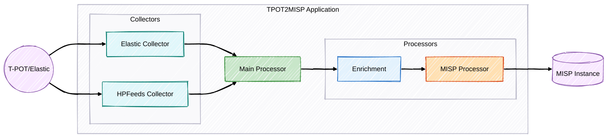

# T-Pot to MISP Integration

[](project-pt.br.md)

<p align="center">
  
  
</p>

Scalable integration between the T-Pot honeypot platform and the Malware Information Sharing Platform (MISP), designed to support organizations at varying levels of threat‑intelligence maturity.

> **Note:** This project was developed to address a real integration need.

## 📋 Index
1. [Overview](#overview)
2. [Architecture](#architecture)
3. [Operation Modes](#operation-modes)
4. [Main Components](#main-components)
5. [Processing Flow](#processing-flow)
6. [Indicator Enrichment](#indicator-enrichment)
7. [Correlation and Event Creation](#correlation-and-event-creation)
8. [Configuration](#configuration)
9. [Use Cases](#use-cases)
10. [Monitoring and Diagnostics](#monitoring-and-diagnostics)
11. [Development and Extension](#development-and-extension)
12. [Frequently Asked Questions](#frequently-asked-questions)

---

## 🔍 Overview

### Motivation

Honeypots capture compromise attempts and generate large volumes of data about potential threats. The traditional process of analyzing this data is manual:

1. Extract logs from honeypots
2. Analyze suspicious indicators (IPs, URLs, etc.)
3. Manually enrich with information from external sources
4. Create events in MISP
5. Publish for sharing with the community

Our project automates this chain, allowing analysts to focus on validating and analyzing more complex threats and also enables the implementation of cyber intelligence for different maturity levels.

### Benefits

- **Time savings**: Automates repetitive tasks of enrichment and event creation
- **Consistency**: Ensures all events follow the same formatting standard
- **Speed**: Reduces the time between detection and sharing
- **Flexibility**: Adapts to different configurations and workflows
- **Quality**: Automatically enriches indicators with multiple intelligence sources

### Educational Purpose

This project was developed not only as a practical solution for T-Pot/MISP integration but also as an in-depth study of:

- **Communication with the MISP API**: Exploring the possibilities and limitations of the threat intelligence API
- **Parsing and querying via Elasticsearch**: Learning efficient techniques for extracting relevant data
- **Implementation of the PyMISP library**: Understanding the practical use of the official library for automating tasks in MISP
- **Modular Python architecture**: Applying software design principles to create maintainable and extensible code

---

## 🏗️ Architecture

The project follows a modular architecture with a clear separation of responsibilities:



### Project Structure

```
tpot2misp/
├── collectors/               # Data collection modules
│   ├── elastic_collector.py  # Batch mode collection via Elasticsearch
│   └── hpfeeds_collector.py  # Real-time collection via HPFEEDS
├── processors/               # Data processing modules
│   ├── misp_processor.py     # MISP integration logic
│   └── enrichment_processor.py # IoC enrichment functionality
├── utils/                    # Utility modules
│   ├── elasticsearch_client.py # Custom client for T-Pot's Elasticsearch
│   ├── error_handling.py     # Centralized error handling
│   ├── logging.py            # Structured logging
│   ├── metrics.py            # Prometheus metrics
│   └── validators.py         # IP validation utilities
├── config/                   # Configuration files
│   ├── __init__.py
│   └── settings.py           # Settings loaded from the environment
├── docker/                   # Docker-related files
│   └── Dockerfile            # Instructions to build the Docker image
├── docs/                     # Documentation
│   └── project.md            # Detailed project documentation
├── scripts/                  # Utility scripts
│   ├── attack_simulator_scapy.py       # Attack simulator for testing
│   ├── start-tpot2misp.sh              # Script to start the Docker container
│   ├── test_elasticsearch_connection.py # Elasticsearch connection test
│   └── test_misp_connection.py         # MISP connection test
├── docker-compose.yml        # Docker Compose configuration
├── .env                      # Environment variable configuration
└── main.py                   # Application entry point
```

### Design Principles

1. **Separation of Responsibilities**: Each component has a specific function
2. **Clear Interfaces**: Components communicate through standardized interfaces
3. **Configurability**: Behavior modifiable via configuration
4. **Observability**: Structured logs and metrics
5. **Resilience**: Error handling and fault recovery

---

## 🔄 Operation Modes

### Batch Mode

- Processes T-Pot events via Elasticsearch (`collectors/elastic_collector.py`)
- Ideal for scheduled execution (cron)
- Low resource consumption

**Typical configuration:**
```env
COLLECTION_MODE=batch
ELASTICSEARCH_URL=http://localhost:9200
ELASTICSEARCH_USER=elastic
ELASTICSEARCH_PWD=changeme
TPOT_HONEYPOTS=cowrie,dionaea
LOOKBACK_DAYS=1
```

### Realtime Mode

- Connects to T-Pot's HPFEEDS broker (`collectors/hpfeeds_collector.py`)
- Processes events in real-time
- Near-instantaneous response to new attacks

**Typical configuration:**
```env
COLLECTION_MODE=realtime
HPFEEDS_HOST=localhost
HPFEEDS_PORT=10000
HPFEEDS_IDENT=tpot
HPFEEDS_SECRET=your-secret-key
HPFEEDS_CHANNELS=tpot.events
```

---

## 🧩 Main Components

### Event Collectors (`collectors/`)

#### ElasticCollector (`elastic_collector.py`)
- Reads and analyzes T-Pot events via Elasticsearch
- Supports multiple honeypot types
- Uses the Strategy pattern for different honeypot types
- Optimized queries for better performance

#### HPFeedsCollector (`hpfeeds_collector.py`)
- Real-time collection via HPFEEDS
- Persistent connection and automatic reconnection
- Asynchronous message processing

### Processors (`processors/`)

#### EnrichmentProcessor (`enrichment_processor.py`)
- Manages multiple enrichment providers
- Parallel processing and caching
- Reputation and validity assessment

#### Providers (within `EnrichmentProcessor`)
- **VirusTotalEnricher**: global reputation, statistics
- **AbuseIPDBEnricher**: abuse score, history
- **GreyNoiseEnricher**: known scanners, classification

#### MISPProcessor (`misp_processor.py`)
- Structured event creation in MISP
- Correlation with existing events
- Addition of standardized objects and attributes
- Support for taxonomies and tags

### Utilities (`utils/`)

#### Logging (`logging.py`)
- Structured logs in JSON or text
- Configurable levels and automatic file rotation

#### Metrics (`metrics.py`)
- Prometheus metrics: events, errors, duration, etc.
- Exposure via HTTP endpoint

#### Error Handling (`error_handling.py`)
- Classes and functions for centralized error handling
- Ensures resilience and detailed logging of failures

#### Validators (`validators.py`)
- Functions to validate input data (e.g., IPs)

#### Validation Report (`validation_report.py`)
- Generation of detailed reports for analyst validation
- Support for TXT and JSON formats
- Attribute tracking by honeypot type
- Accounting of created and updated MISP events
- Total statistics for easy validation

### Utility Scripts (`scripts/`)

The utility scripts provide diagnostic, testing, and system initialization tools:

#### `test_elasticsearch_connection.py`
Diagnostic script that tests the connection to T-Pot's Elasticsearch:
- Uses the custom client (`elasticsearch_client.py`)
- Checks authentication, connection, and index availability
- Provides detailed error messages for easy troubleshooting
- Implemented with specific handling for common issues (HTTP headers, SSL)

#### `test_misp_connection.py`
Diagnostic script that tests communication with the MISP instance:
- Checks configuration and authentication with the MISP API
- Tests basic operations (get version, search events, attributes, and taxonomies)
- Compatible with different versions of the PyMISP API
- Provides detailed guidance for problem resolution

#### `attack_simulator_scapy.py`
Attack simulator to test the detection pipeline:
- Uses the Scapy library to generate simulated traffic
- Allows controlled testing without exposure to real threats
- Useful for validating T-Pot configuration and MISP integration
- Tool for integration testing and full pipeline validation

#### `start-tpot2misp.sh`
Initialization script for the Docker environment:
- Creates necessary directories for data persistence
- Configures appropriate permissions
- Starts the TPot2MISP application using `docker-compose up -d`
- Provides feedback on the initialization status

### Entry Point (`main.py`)
The `main.py` is the heart of the application:
- Orchestrates the application flow based on the operation mode
- Initializes collectors, processors, and utilities
- Manages the application lifecycle and signal handling

---

## ⚙️ Processing Flow

1. **Initialization** (`main.py`): 
   - Loads configurations (`settings.py`)
   - Initializes logger (`logging.py`), metrics (`metrics.py`)
   - Initializes processors (`MISPProcessor`, `EnrichmentProcessor`)

2. **Event Collection** (`main.py` -> `collectors/`): 
   - Instantiates the appropriate collector based on `COLLECTION_MODE`
   - **Batch**: `ElasticCollector` fetches events from Elasticsearch
   - **Realtime**: `HPFeedsCollector` connects to HPFEEDS and receives events

3. **Indicator Processing** (`main.py` -> `processors/`):
   - For each collected indicator:
     - **Validation** (`validators.py`): Checks if the indicator is valid
     - **Enrichment** (`EnrichmentProcessor`): Queries providers, uses cache
     - **Creation/Update in MISP** (`MISPProcessor`): Checks correlation, creates/updates event

4. **Logging and Metrics** (`utils/`): 
   - Throughout the process, detailed logs are generated (`logging.py`)
   - Metrics are updated (`metrics.py`)

5. **Error Handling** (`utils/error_handling.py`): 
   - Errors at any stage are captured, logged, and managed

---

## 🔎 Indicator Enrichment

- Managed by `EnrichmentProcessor` (`processors/enrichment_processor.py`)
- Checks internal cache to avoid repeated queries
- Queries multiple providers in parallel
- Aggregates results and assesses validity
- Dynamic TTL for cache (high risk = shorter TTL)

---

## 🔗 Correlation and Event Creation

- Managed by `MISPProcessor` (`processors/misp_processor.py`)
- Searches for existing events in MISP for the same honeypot type and day
- Creates a single daily event per honeypot type
- Adds attributes (IPs, etc.) and MISP objects to the event
- Applies tags based on enrichment results and honeypot type
- Manages event publication (automatic or manual)

---

## ⚙️ Configuration

All configuration is done via environment variables, preferably defined in a `.env` file at the project root:

```env
# Operation Mode ('batch' or 'realtime')
COLLECTION_MODE=batch

# MISP
MISP_URL=https://your-misp-instance
MISP_KEY=your-misp-api-key
MISP_VERIFY_SSL=false # Set to true in production with valid certificate
AUTO_PUBLISH=false    # Automatically publish events?
PUBLISH_DELAY=3600    # Delay in seconds for auto-publishing (if AUTO_PUBLISH=true)

# Batch (Elasticsearch)
ELASTICSEARCH_URL=http://localhost:9200
ELASTICSEARCH_USER=elastic
ELASTICSEARCH_PASSWORD=changeme
TPOT_HONEYPOTS=cowrie,dionaea # List of honeypots to process
LOOKBACK_DAYS=1             # How many days back to fetch events

# Realtime (HPFEEDS)
HPFEEDS_HOST=localhost
HPFEEDS_PORT=10000
HPFEEDS_IDENT=tpot
HPFEEDS_SECRET=your-secret-key
HPFEEDS_CHANNELS=tpot.events # HPFEEDS channels to subscribe to

# Enrichment
ENRICHMENT_ENABLED=true
ENRICHMENT_CACHE_DURATION=86400 # Cache duration in seconds (1 day)

VIRUSTOTAL_ENABLED=true
VIRUSTOTAL_API_KEY=your-vt-key

ABUSEIPDB_ENABLED=true
ABUSEIPDB_API_KEY=your-abuseipdb-key

GREYNOISE_ENABLED=true
GREYNOISE_API_KEY=your-greynoise-key

# Logs
LOG_LEVEL=INFO # DEBUG, INFO, WARNING, ERROR, CRITICAL
LOG_FILE_ENABLED=true
LOG_FILE_PATH=logs/tpot2misp.log # Path relative to project root
LOG_FORMAT=json # 'json' or 'text'

# Metrics (Prometheus)
PROMETHEUS_ENABLED=true
PROMETHEUS_PORT=9431
```

---

## 📋 Use Cases

### Batch Execution

```bash
# Schedule via cron
0 * * * * cd /path/to/tpot2misp && python main.py
```

### Realtime Execution

```bash
python main.py
```

### SOC Integration
- Prometheus metrics for Grafana
- Logs for Splunk/Elasticsearch

---

## 📊 Monitoring and Diagnostics

### Structured Logs

```json
{
  "timestamp": "2025-04-21T10:00:00Z",
  "level": "INFO",
  "logger": "tpot2misp",
  "message": "Collected 50 events in batch mode",
  "events": {
    "total": 50,
    "by_honeypot": {
      "cowrie": 30,
      "dionaea": 20
    }
  }
}
```

### Prometheus Metrics

Available at `http://<host>:<PROMETHEUS_PORT>/metrics` if `PROMETHEUS_ENABLED=true`.

```
# HELP tpot2misp_events_processed_total Total events processed
# TYPE tpot2misp_events_processed_total counter
tpot2misp_events_processed_total{mode="batch", honeypot="cowrie"} 150

# HELP tpot2misp_indicators_enriched_total Total indicators enriched
# TYPE tpot2misp_indicators_enriched_total counter
tpot2misp_indicators_enriched_total{provider="virustotal"} 120

# HELP tpot2misp_enrichment_cache_hits_total Total enrichment cache hits
# TYPE tpot2misp_enrichment_cache_hits_total counter
tpot2misp_enrichment_cache_hits_total{provider="abuseipdb"} 85

# HELP tpot2misp_indicator_processing_duration_seconds Indicator processing duration
# TYPE tpot2misp_indicator_processing_duration_seconds histogram
# ... (buckets and summary)

# HELP tpot2misp_hpfeeds_connection_status HPFEEDS connection status (1=connected, 0=disconnected)
# TYPE tpot2misp_hpfeeds_connection_status gauge
tpot2misp_hpfeeds_connection_status 1
```

---

## 🛠️ Development and Extension

### Adding New Honeypots (Batch Mode)

To add support for a new honeypot in batch mode:

1. Create a new strategy class in `collectors/elastic_collector.py` inheriting from `HoneypotStrategy`:
```python
from .base_strategy import HoneypotStrategy # Example

class NewHoneypotStrategy(HoneypotStrategy):
    def get_query(self, start_time: str, end_time: str) -> Dict[str, Any]:
        # Implement the Elasticsearch query specific to this honeypot
        return {
            "query": {
                "bool": {
                    "filter": [
                        {"term": {"event.kind": "event"}}, # Adjust as needed
                        {"term": {"honeypot.type": "new_honeypot_type"}}, # Adjust as needed
                        {"range": {"@timestamp": {"gte": start_time, "lt": end_time}}}
                    ]
                }
            }
        }

    def parse_event(self, hit: Dict[str, Any]) -> Optional[Dict[str, Any]]]:
        # Implement the logic to extract relevant data from the Elasticsearch hit
        source_ip = hit.get("_source", {}).get("source", {}).get("ip")
        if not source_ip:
            return None
        return {
            "source_ip": source_ip,
            "timestamp": hit.get("_source", {}).get("@timestamp"),
            "honeypot_type": "new_honeypot_type",
            # Add other relevant fields
        }
```

2. Add the strategy to the `_strategies` dictionary in the `ElasticCollector` constructor:
```python
self._strategies = {
    'cowrie': CowrieStrategy(self._es),
    'dionaea': DionaeaStrategy(self._es),
    'new_honeypot_type': NewHonepotStrategy(self._es) # Add here
}
```

3. Update the `TPOT_HONEYPOTS` configuration in your `.env` file:
```env
TPOT_HONEYPOTS=cowrie,dionaea,new_honeypot_type
```

### Adding New Enrichment Providers

To add a new enrichment provider:

1. Create a new enricher class inheriting from `BaseEnricher`:
```python
from .base_enricher import BaseEnricher # Example

class NewProviderEnricher(BaseEnricher):
    async def enrich(self, indicator: str) -> Dict[str, Any]:
        # Implement the API call logic and response parsing
        api_key = self.settings.get("NEW_PROVIDER_API_KEY")
        if not api_key:
            # Log warning
            return {}
        # ... API logic ...
        return {"new_provider_data": "some_value"}
```

2. Add the necessary configurations in `config/settings.py` and `.env.example`.

3. Update the `EnrichmentProcessor` to instantiate and use the new enricher:
```python
# In EnrichmentProcessor.__init__
if self.settings.NEW_PROVIDER_ENABLED:
    self.enrichers.append(NewProviderEnricher(self.settings, self.cache))
```

---

## ❓ Frequently Asked Questions

### Why use Elasticsearch instead of reading log files directly?

T-Pot already installs and configures Elasticsearch by default. Using Elasticsearch offers several advantages:

1. **Performance**: Data already indexed and optimized for search
2. **Simplicity**: No need to manage log files
3. **Flexibility**: Advanced queries and efficient filters
4. **Scalability**: Better for large volumes of data

### How does the integration with T-Pot's Elasticsearch work?

T-Pot already configures Elasticsearch and indexes all honeypot events. Our application:

1. Connects to T-Pot's Elasticsearch
2. Uses specific queries for each honeypot type
3. Processes the events and sends them to MISP

### Can I use batch and realtime modes simultaneously?

No, the application operates in a single mode at a time. Choose the mode that best suits your use case:

- **Batch**: Ideal for periodic execution via cron
- **Realtime**: Ideal for continuous processing and quick response
