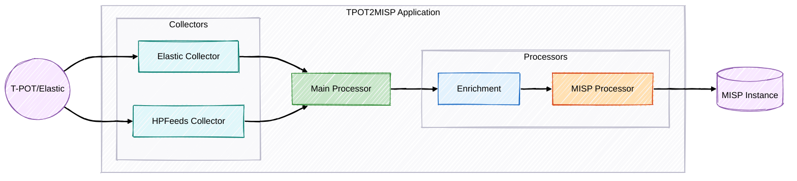

# T-Pot to MISP Integration

  
  
  

Uma solução robusta e escalável para integração entre a plataforma de honeypots T‑Pot e o Malware Information Sharing Platform (MISP), projetada para suportar organizações em diferentes níveis de maturidade em inteligência de ameaças.

## 📋 Índice

- [Visão Geral](#-visão-geral)
- [Recursos Principais](#-recursos-principais)
- [Arquitetura Simplificada](#️-arquitetura-simplificada)
- [Requisitos](#-requisitos)
- [Instalação](#-instalação)
  - [Método Docker (Recomendado)](#método-docker-recomendado)
  - [Método Tradicional](#método-tradicional)
- [Configuração](#️-configuração)
- [Como Usar](#-como-usar)
- [Monitoramento e Validação](#-monitoramento-e-validação)
- [Troubleshooting](#-troubleshooting)
- [Documentação Técnica Detalhada](#-documentação-técnica-detalhada)
- [Licença](#-licença)

## 🔍 Visão Geral

Esta aplicação automatiza a coleta de dados de ataques de honeypots T-Pot, os enriquece (opcionalmente) e os envia para uma instância MISP, criando eventos estruturados para análise e compartilhamento de inteligência de ameaças.

**Modos de Operação:**
- **Batch:** Coleta dados periodicamente do Elasticsearch do T-Pot.
- **Real-time:** Coleta dados em tempo real via HPFEEDS.

## ✨ Recursos Principais

- **Coleta Flexível:** Suporte aos modos Batch (Elasticsearch) e Real-time (HPFEEDS).
- **Agrupamento Inteligente:** Cria um evento MISP diário por tipo de honeypot, evitando duplicatas.
- **Enriquecimento Opcional:** Integração com VirusTotal, AbuseIPDB e GreyNoise (com cache).
- **Revisão Facilitada:** Eventos criados como não publicados por padrão (publicação automática configurável).
- **Monitoramento:** Métricas Prometheus opcionais e logs estruturados.
- **Relatório de Validação:** Geração automática de relatórios (TXT/JSON) para facilitar a validação dos dados enviados ao MISP.
- **Resiliência:** Tratamento robusto de erros.

## 🏗️ Arquitetura Simplificada

O sistema possui coletores (Elasticsearch, HPFEEDS), processadores (Enriquecimento, MISP) e utilitários (Logging, Métricas, Validação, etc.), orquestrados pelo `main.py`.

*Para uma visão detalhada da arquitetura e estrutura de arquivos, consulte a [Documentação Técnica](docs/project.md#arquitetura).*

## 📋 Requisitos

- Python 3.8+
- T-Pot instalado e configurado (com Elasticsearch ou HPFEEDS habilitado)
- Instância MISP acessível com chave de API
- (Opcional) Chaves de API para serviços de enriquecimento
- (Opcional) Docker e Docker Compose

## 🚀 Instalação

### Método Docker (Recomendado)

1.  Clone o repositório: `git clone https://github.com/seu-usuario/tpot2misp.git && cd tpot2misp`
2.  Copie e edite o arquivo `.env`: `cp .env.example .env && nano .env`
3.  Execute: `chmod +x scripts/start-tpot2misp.sh && ./scripts/start-tpot2misp.sh`

**Comandos úteis:**
- Logs: `docker-compose logs -f`
- Parar: `docker-compose down`
- Reiniciar: `docker-compose restart`
- Rebuild: `docker-compose build && docker-compose up -d`

### Método Tradicional

1.  Clone o repositório e entre no diretório.
2.  Crie um ambiente virtual: `python -m venv venv && source venv/bin/activate` (ou `venv\Scripts\activate` no Windows)
3.  Instale dependências: `pip install -r requirements.txt`
4.  Configure o `.env`: `cp .env.example .env && nano .env`

## ⚙️ Configuração

A configuração principal é feita via arquivo `.env`. Copie `.env.example` para `.env` e ajuste as variáveis:

- **`COLLECTION_MODE`**: `batch` ou `realtime`.
- **Configurações MISP**: `MISP_URL`, `MISP_KEY`, `MISP_VERIFY_SSL`, `AUTO_PUBLISH`, `PUBLISH_DELAY`.
- **Configurações Batch (Elasticsearch)**: `ELASTICSEARCH_URL`, `ELASTICSEARCH_USER`, `ELASTICSEARCH_PASSWORD`, `TPOT_HONEYPOTS`, `LOOKBACK_DAYS`.
- **Configurações Realtime (HPFEEDS)**: `HPFEEDS_HOST`, `HPFEEDS_PORT`, `HPFEEDS_IDENT`, `HPFEEDS_SECRET`, `HPFEEDS_CHANNELS`.
- **Configurações de Enriquecimento**: `ENRICHMENT_ENABLED`, `CACHE_DURATION`, chaves de API (`VIRUSTOTAL_API_KEY`, etc.).
- **Configurações de Log**: `LOG_LEVEL`, `LOG_FILE_ENABLED`, `LOG_FILE_PATH`, `LOG_FORMAT`.
- **Relatório de Validação**: `VALIDATION_REPORT_ENABLED`, `VALIDATION_REPORT_DIR`, `VALIDATION_REPORT_FORMAT`.
- **Métricas Prometheus**: `PROMETHEUS_ENABLED`, `PROMETHEUS_PORT`.

*Para detalhes sobre cada variável de configuração, consulte a [Documentação Técnica](docs/project.md#configuração).*

## 📝 Como Usar

Após a instalação e configuração:

- **Modo Batch (Execução Única ou Periódica):**
  - Se `BATCH_INTERVAL_HOURS` > 0 no `.env`, ele rodará periodicamente.
  - Se `BATCH_INTERVAL_HOURS` = 0 ou não definido, rodará uma vez e sairá.
  - Execute: `python main.py` (ou via Docker).
  - Para agendamento (se não usar `BATCH_INTERVAL_HOURS`), use `cron` ou Agendador de Tarefas do Windows. Exemplo cron: `0 * * * * cd /path/to/tpot2misp && ./venv/bin/python main.py`

- **Modo Real-time:**
  - Execute: `python main.py` (ou via Docker).
  - Use um gerenciador de processos (systemd, supervisor) para execução contínua em produção.

## 📊 Monitoramento e Validação

- **Logs:** Verifique o console ou o arquivo configurado em `LOG_FILE_PATH`.
- **Relatório de Validação:** Arquivos TXT/JSON gerados no diretório `VALIDATION_REPORT_DIR` após execuções em modo batch. Útil para analistas verificarem os dados enviados.
- **Métricas Prometheus:** Acesse `http://<host>:<PROMETHEUS_PORT>/metrics` se habilitado.

*Para detalhes sobre as métricas e o formato dos logs/relatórios, consulte a [Documentação Técnica](docs/project.md#monitoramento-e-diagnóstico).*

## 🚑 Troubleshooting

- **Erro `media_type_header_exception` (Elasticsearch):** Geralmente causado pelo proxy Nginx do T-Pot. O cliente customizado neste projeto (`utils/elasticsearch_client.py`) já lida com isso. Verifique suas credenciais e URL (`https://<tpot-ip>:64297/es/` - a barra final é importante).
- **Erro 401 (Elasticsearch/MISP):** Verifique as credenciais (`ELASTICSEARCH_USER`/`PASSWORD` ou `MISP_KEY`) no `.env`.
- **Sem eventos coletados:** Verifique a configuração `TPOT_HONEYPOTS`, `LOOKBACK_DAYS` (batch) ou `HPFEEDS_CHANNELS` (realtime). Certifique-se que o T-Pot está gerando eventos.
- **Use os scripts de teste:**
  - `python scripts/test_elasticsearch_connection.py`
  - `python scripts/test_misp_connection.py`

## 📚 Documentação Técnica Detalhada

Para informações aprofundadas sobre a arquitetura, fluxo de processamento, detalhes dos componentes, guias de extensão e mais, consulte o documento:

➡️ **[`docs/project.md`](docs/project.md)**

## 📜 Licença

Este projeto está licenciado sob a Licença MIT. Veja o arquivo `LICENSE` para mais detalhes.

